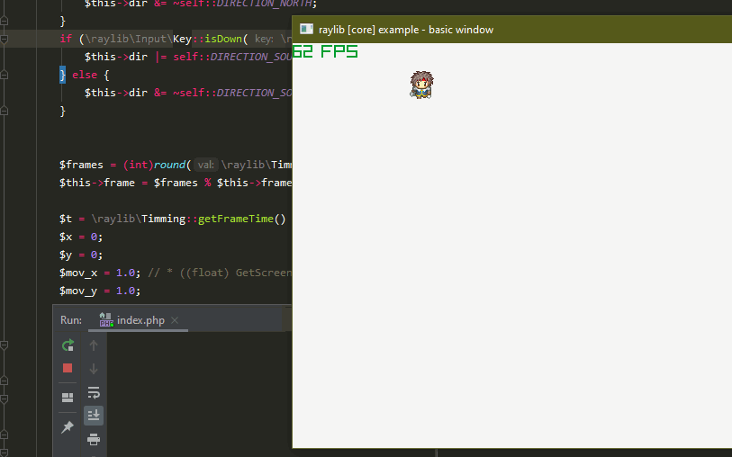
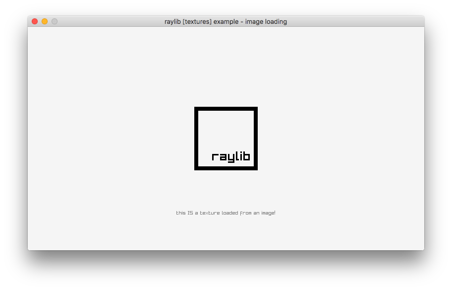
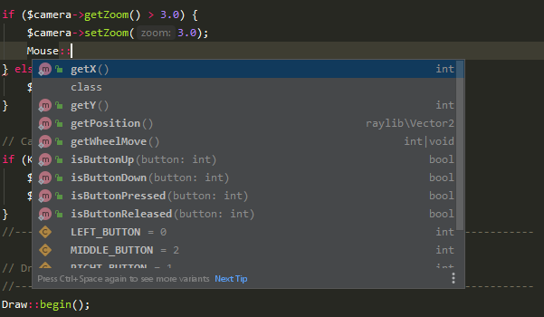

# raylib-php

PHP 8.x bindings for RayLib, a simple and easy-to-use library to learn video games programming (www.raylib.com)

This is currently a work-in-progress and bindings are not complete and are likely to change. Progress of binding can be tracked via
[MAPPING.md](MAPPING.md)

 - raylib.h - 203 of 422 functions ~ %49 complete (49 Functions are not going to be implemented)
 - raymath.h - TODO Extra mathy stuff
 - raygui.h - TODO API for drawing GUI
 - physac.h - TODO More complex collision detection, more than built-in collision detection

## Other PHP RayLib Bindings

While mine may have been the first, its certainly taken a long time as all of code I've written is by hand. If you want 
to try another binding, then you can try these others.

 - [PHP Raylib FFI](https://github.com/nawarian//raylib-ffi) - Uses PHP's built-in FFI (Foreign Function Interface) to 
   connect directly to the shared RayLib.dll/.so file. This will be slower than a native binding.
 - [PHP Raylib CPP](https://github.com/oraoto/raylib-phpcpp) - Uses PHP CPP to create bindings and uses automation to 
   map functions. This extension has quirks with handling sub-objects. It is will always be up to date soon than 
   anything I can do.

## Isn't PHP A Terrible Choice For Games?

Here are some common misconceptions:

 - **PHP has no multi-threading**. There are native PHP extensions to enable this, pThreads and now a easier way to tackle this issue Parallel - https://github.com/krakjoe/parallel
 - **PHP is too slow**. Since PHP 7 a lot of things have gotten faster, so it can out perform Python and NodeJS in some area. PHP 8 is to include a JIT which should provide even more performance, ETA of PHP is around December of 2020.
 - **Object Oriented Programming in PHP is horrible**. Since PHP 5.4+ you get a lot of feature parity and since PHP 7 you now get type checking.
 - **Garbage Collection IS ... GARBAGE** - Until PHP 7.3 this was true. Running PHP in a tight loop for hours/days on end would hit a point where PHP could spend more time doing GC than anything else. This has been greatly improved.
 - **PHP Has No Code Reload** - Well not built-in. But, any language with `eval` can have code reloading. With that said I have code reloading using [SoftMocks](https://github.com/badoo/soft-mocks), but there is also a native PHP extension [Runkit7](https://github.com/runkit7/runkit7).
 

## Example



```php
<?php

use raylib\Color;
use raylib\Draw;
use raylib\Text;
use raylib\Timming;
use raylib\Window;

// Initialization
//--------------------------------------------------------------------------------------
$screenWidth  = 800;
$screenHeight = 450;
$lightGray    = new Color(245, 245, 245, 255);
$gray         = new Color(200, 200, 200, 255);

Window::init($screenWidth, $screenHeight, "raylib [core] example - basic window");

Timming::setTargetFps(60);
//--------------------------------------------------------------------------------------

// Main game loop
while (!Window::shouldClose())    // Detect window close button or ESC key
{
    // Update
    //----------------------------------------------------------------------------------
    // TODO: Update your variables here
    //----------------------------------------------------------------------------------

    // Draw
    //----------------------------------------------------------------------------------
    Draw::begin();

    Draw::clearBackground($lightGray);

    Text::draw("Congrats! You created your first window!", 190, 200, 20, $gray);

    Draw::end();
    //----------------------------------------------------------------------------------
}

// De-Initialization
//--------------------------------------------------------------------------------------
Window::close();        // Close window and OpenGL context
//--------------------------------------------------------------------------------------
```

## Autocomplete

Classes and method calls are available via a stub repository. Its contains all the classes and methods so you get information on everything and anything implemented.



Install via composer:

    composer require --dev joseph-montanez/raylib-php-stub

More information on the stubs can be found here at the repository [RayLib-PHP-Stubs](https://github.com/joseph-montanez/RayLib-PHP-Stubs)

## License

raylib-php is licensed under an unmodified zlib/libpng license, which is an OSI-certified, 
BSD-like license that allows static linking with closed source software. Check [LICENSE](LICENSE) for further details.
	
*Copyright (c) 2017 Joseph Montanez ([@joseph-montanez](https://twitter.com/shabb_jm))*

## Binary Releases

[Windows PHP Extension DLL](https://github.com/joseph-montanez/raylib-php/releases)

## API Differences

RayLib is a library designed for procedural code. All functions live in a global scope. While I could and still can do this, I'd prefer to organize and namespace the API.

For example instead of calling `CheckCollisionPointTriangle()`, in PHP you'd call `raylib\Collision::checkPointTriangle()`. That static class method could technically live as a scoped function instead for example `raylib\Collision\checkPointTriangle` however this could become make importing far more tedious. 

If this becomes a bigger problem, I can create a procedural API compatibility later to better align to RayLib's C-API.

## API Limitation

The PHP RayLib implementation has two glaring limitations.

 - Not all object properties are read and write, for example `/raylib/Image::width` is a read-only property but `/raylib/Vector2::x` is a read/write property. When you want to alter a property that is read-only there should be method calls such as `/raylib/Image::resize()` that will adjust the properties for you.
 - All RayLib object assignment i.e `$player->position = $position` will **not copy** the variable but instead **link** the property. So if you want to copy the data instead, you need to use PHP's clone feature `clone` i.e `$player->position = clone $position`.

## How To Build PHP Extension

Windows is by far the hardest platform to support and build for. Please use the binaries for Windows instead unless you want to commit fixes to this repo.

### MacOS & Linux

#### Ubuntu 19.10

    sudo apt-get install -y libx11-dev xorg-dev

#### Build

    phpize
    ./configure
    make

### Windows

Windows requires compiling with PHP sources (Currently Visual Studio 2017 needed), you will still get a .dll in the end.

You will need to also compile RayLib as well. At the time writing I am using Visual Studio 2019 compiler, since PHP 8 requires this. Once compiled paste the following files:

(Please note your Raylib and PHP paths may be different)

**Static Libs**

    C:\src\raylib-2.6.0\cmake-build-debug\src\external\glfw\src\glfw3.lib -> C:\php-sdk\phpmaster\vc15\x64\deps\lib\raylib\glfw3.lib
    C:\src\raylib-2.6.0\cmake-build-debug\src\raylib_static.lib -> C:\php-sdk\phpmaster\vc15\x64\deps\lib\raylib\raylib_static.lib

**GLFW Includes**

    C:\src\raylib-2.6.0\cmake-build-debug\src\external\glfw\src\glfw_config.h -> C:\php-sdk\phpmaster\vc15\x64\deps\include\GLFW\glfw_config.h
    C:\src\raylib-2.6.0\src\external\glfw\include\GLFW\glfw3.h -> C:\php-sdk\phpmaster\vc15\x64\deps\include\GLFW\glfw3.h
    C:\src\raylib-2.6.0\src\external\glfw\include\GLFW\glfw3native.h -> C:\php-sdk\phpmaster\vc15\x64\deps\include\GLFW\glfw3native.h

**RayLib Includes**

    C:\src\raylib-2.6.0\cmake-build-debug\src\raudio.h -> C:\php-sdk\phpmaster\vc15\x64\deps\include\raudio.h
    C:\src\raylib-2.6.0\cmake-build-debug\src\raylib.h -> C:\php-sdk\phpmaster\vc15\x64\deps\include\raylib.h
    C:\src\raylib-2.6.0\cmake-build-debug\src\raymath.h -> C:\php-sdk\phpmaster\vc15\x64\deps\include\raymath.h
    C:\src\raylib-2.6.0\cmake-build-debug\src\rlgl.h -> C:\php-sdk\phpmaster\vc15\x64\deps\include\rlgl.h

Once you have PHP & Raylib setup you can then compile the extension

    %comspec% /k "C:\Program Files (x86)\Microsoft Visual Studio\2017\BuildTools\VC\Auxiliary\Build\vcvars64.bat"
    cd C:/php-sdk
    phpsdk-vs16-x64.bat
    cd phpmaster\vc15\x64\php-src
    cls && buildconf --force && configure --disable-all --enable-cli --with-raylib && nmake

## How To Run raylib PHP Extension

### MacOS & Linux

    php -dextension=modules/raylib.so examples/textures/textures_image_loading.php

### Windows

    php.exe -dextension=modules/php7raylib-2.0.0-dev.dll examples/textures/textures_image_loading.php
